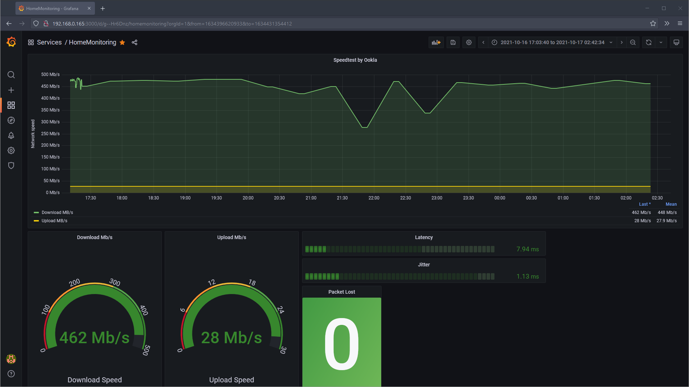

# Ookla CLI Speedtest Exporter
[](http://golang.org)
[](https://github.com/cloudziu/ookla-speedtest-exporter)
[](https://goreportcard.com/report/github.com/cloudziu/ookla-speedtest-exporter)


Speedtest tool: https://www.speedtest.net/apps/cli wraped in Golang code to expose Internet connection metrics in Prometheus format:
- Download Speed
- Upload Speed
- Latency
- Jitter
- PacketLost

# Provided Grafana dashboard


# Build ookla-speedtest-exporter
Build the exporter image.
```bash
docker build . -t ookla-speedtest-exporter:local
```

# Accept license
Ookla Speedtest cli app requires to accepst licens.
```bash
docker container run --rm -v "$(pwd)"/license/ookla:/root/.config/ookla --name acceptLicense
```

# Running exporter in docker-compose
This will start the speedtest-exporter container with configured Prometheus and Grafana.
```bash
docker-compose up -d
```
## Access applications
Connect on `localhost:$PORT`
| Service      | Port           |
| :---         |     :---:      |
| Prometheus   | :9090          |
| Grafana      | :3000          |
| Speedtest    | :9000          |
# Change sccrape interval

Scrape interval is set in `./conf/prometheus/prometheus.yml` for 30 min.

```yaml
#./conf/prometheus/prometheus.yml
scrape_configs:
  - job_name: speedtest-ookla
    scrape_interval: 30m # <-- 
```
